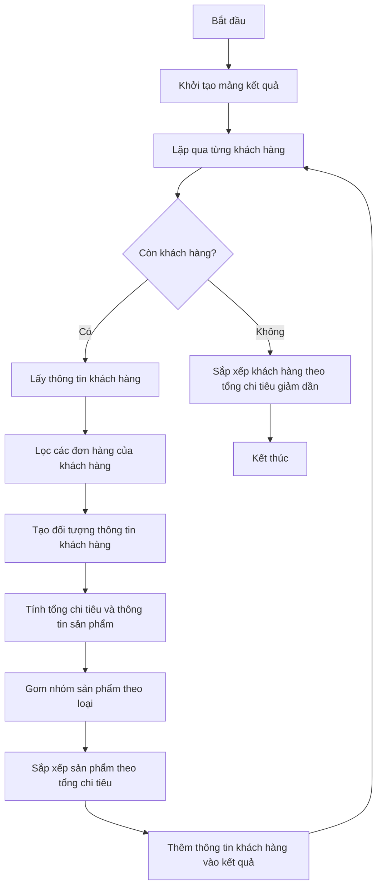

# Phân tích và giải bài toán tính tổng đơn hàng của khách hàng

## Đề bài

1. Tính tổng giá trị đơn hàng của từng customer
2. Sắp xếp theo customer mua nhiều đến ít
3. Trong mỗi customer có các sản phẩm (products) mà customer đó đã mua (sắp xếp theo tổng giá trị mua hàng từ lớn đến bé)

## Dữ liệu đầu vào

```javascript
const customers = [
    { id: 1, name: "John Doe" },
    { id: 2, name: "Jane Smith" },
    { id: 3, name: "Alice Johnson" },
    { id: 4, name: "Bob Brown" },
    { id: 5, name: "Charlie Green" },
];

const products = [
    { id: 101, name: "Laptop", price: 1200 },
    { id: 102, name: "Phone", price: 800 },
    { id: 103, name: "Tablet", price: 500 },
    { id: 104, name: "Smartwatch", price: 300 },
    { id: 105, name: "Headphones", price: 150 },
];

const orders = [
    { id: 1001, customerId: 1, items: [{ productId: 101, quantity: 2 }, { productId: 102, quantity: 1 }] },
    { id: 1002, customerId: 2, items: [{ productId: 102, quantity: 1 }, { productId: 103, quantity: 3 }] },
    { id: 1003, customerId: 3, items: [{ productId: 104, quantity: 5 }, { productId: 105, quantity: 2 }] },
    { id: 1004, customerId: 4, items: [{ productId: 101, quantity: 1 }, { productId: 103, quantity: 2 }] },
    { id: 1005, customerId: 5, items: [{ productId: 105, quantity: 10 }] },
    { id: 1006, customerId: 1, items: [{ productId: 101, quantity: 1 }, { productId: 105, quantity: 3 }] },
    { id: 1007, customerId: 2, items: [{ productId: 104, quantity: 2 }, { productId: 103, quantity: 1 }] },
    { id: 1008, customerId: 3, items: [{ productId: 102, quantity: 2 }] },
    { id: 1009, customerId: 4, items: [{ productId: 101, quantity: 1 }, { productId: 102, quantity: 1 }] },
    { id: 1010, customerId: 5, items: [{ productId: 103, quantity: 4 }, { productId: 104, quantity: 3 }] },
];
```

## Phân tích bài toán

### Yêu cầu
Bài toán yêu cầu chúng ta:

1. Tính tổng giá trị đơn hàng của từng khách hàng (customer)
2. Sắp xếp các khách hàng theo tổng giá trị mua hàng từ cao đến thấp
3. Với mỗi khách hàng, liệt kê các sản phẩm họ đã mua và sắp xếp theo tổng giá trị mua từ cao đến thấp

### Phương án giải quyết
1. **Gom nhóm đơn hàng theo khách hàng**: Chúng ta cần gom nhóm tất cả đơn hàng theo từng khách hàng
2. **Tính toán số lượng sản phẩm và tổng tiền**: Với mỗi khách hàng, tính tổng số tiền đã chi và tổng số lượng từng loại sản phẩm
3. **Sắp xếp kết quả**: Sắp xếp danh sách khách hàng theo tổng chi tiêu và sắp xếp sản phẩm trong mỗi khách hàng theo tổng chi tiêu

## Sơ đồ khối (Flow Chart)



## Phân tích sơ đồ khối

1. **Khởi tạo mảng kết quả**: Tạo mảng trống để lưu thông tin kết quả
2. **Lặp qua từng khách hàng**: Xử lý từng khách hàng một
3. **Lấy thông tin khách hàng**: Lấy ID và tên của khách hàng
4. **Lọc các đơn hàng của khách hàng**: Tìm tất cả đơn hàng thuộc về khách hàng đang xét
5. **Tạo đối tượng thông tin khách hàng**: Tạo một đối tượng để lưu thông tin tổng hợp của khách hàng
6. **Tính tổng chi tiêu và thông tin sản phẩm**: Duyệt qua các đơn hàng để tính tổng chi tiêu và thông tin về từng sản phẩm đã mua
7. **Gom nhóm sản phẩm theo loại**: Gom nhóm các sản phẩm cùng loại để tính tổng số lượng và tổng chi tiêu
8. **Sắp xếp sản phẩm theo tổng chi tiêu**: Sắp xếp các sản phẩm theo tổng chi tiêu từ cao đến thấp
9. **Thêm thông tin khách hàng vào kết quả**: Thêm thông tin khách hàng đã xử lý vào mảng kết quả
10. **Sắp xếp khách hàng theo tổng chi tiêu**: Sắp xếp danh sách khách hàng theo tổng chi tiêu từ cao đến thấp

## Code giải quyết bài toán

```javascript
/**
 * Hàm tính tổng giá trị mua hàng của từng khách hàng và sắp xếp theo yêu cầu
 * @param {Array} customers - Danh sách khách hàng
 * @param {Array} products - Danh sách sản phẩm
 * @param {Array} orders - Danh sách đơn hàng
 * @returns {Array} - Danh sách kết quả đã sắp xếp
 */
function analyzeCustomerOrders(customers, products, orders) {
    // Bước 1: Khởi tạo mảng kết quả
    const result = [];

    // Bước 2: Xử lý từng khách hàng
    for (const customer of customers) {
        // Bước 3: Lọc các đơn hàng của khách hàng
        const customerOrders = orders.filter(order => order.customerId === customer.id);
        
        // Bước 4: Tạo đối tượng thông tin khách hàng
        const customerInfo = {
            id: customer.id,
            name: customer.name,
            totalSpent: 0,
            products: []
        };
        
        // Bước 5: Tạo đối tượng trung gian để gom nhóm sản phẩm
        const productMap = {};
        
        // Bước 6: Xử lý từng đơn hàng của khách hàng
        for (const order of customerOrders) {
            for (const item of order.items) {
                // Tìm thông tin sản phẩm
                const product = products.find(p => p.id === item.productId);
                
                // Tính tổng giá trị của mặt hàng trong đơn hàng
                const itemTotal = product.price * item.quantity;
                
                // Cập nhật tổng chi tiêu của khách hàng
                customerInfo.totalSpent += itemTotal;
                
                // Cập nhật thông tin sản phẩm trong productMap
                if (!productMap[product.id]) {
                    productMap[product.id] = {
                        name: product.name,
                        quantity: 0,
                        totalSpent: 0
                    };
                }
                
                productMap[product.id].quantity += item.quantity;
                productMap[product.id].totalSpent += itemTotal;
            }
        }
        
        // Bước 7: Chuyển productMap thành mảng để dễ sắp xếp
        for (const productId in productMap) {
            customerInfo.products.push(productMap[productId]);
        }
        
        // Bước 8: Sắp xếp sản phẩm theo tổng chi tiêu giảm dần
        customerInfo.products.sort((a, b) => b.totalSpent - a.totalSpent);
        
        // Bước 9: Thêm thông tin khách hàng vào kết quả
        result.push(customerInfo);
    }
    
    // Bước 10: Sắp xếp khách hàng theo tổng chi tiêu giảm dần
    result.sort((a, b) => b.totalSpent - a.totalSpent);
    
    return result;
}

// Dữ liệu đầu vào
const customers = [
    { id: 1, name: "John Doe" },
    { id: 2, name: "Jane Smith" },
    { id: 3, name: "Alice Johnson" },
    { id: 4, name: "Bob Brown" },
    { id: 5, name: "Charlie Green" },
];

const products = [
    { id: 101, name: "Laptop", price: 1200 },
    { id: 102, name: "Phone", price: 800 },
    { id: 103, name: "Tablet", price: 500 },
    { id: 104, name: "Smartwatch", price: 300 },
    { id: 105, name: "Headphones", price: 150 },
];

const orders = [
    { id: 1001, customerId: 1, items: [{ productId: 101, quantity: 2 }, { productId: 102, quantity: 1 }] },
    { id: 1002, customerId: 2, items: [{ productId: 102, quantity: 1 }, { productId: 103, quantity: 3 }] },
    { id: 1003, customerId: 3, items: [{ productId: 104, quantity: 5 }, { productId: 105, quantity: 2 }] },
    { id: 1004, customerId: 4, items: [{ productId: 101, quantity: 1 }, { productId: 103, quantity: 2 }] },
    { id: 1005, customerId: 5, items: [{ productId: 105, quantity: 10 }] },
    { id: 1006, customerId: 1, items: [{ productId: 101, quantity: 1 }, { productId: 105, quantity: 3 }] },
    { id: 1007, customerId: 2, items: [{ productId: 104, quantity: 2 }, { productId: 103, quantity: 1 }] },
    { id: 1008, customerId: 3, items: [{ productId: 102, quantity: 2 }] },
    { id: 1009, customerId: 4, items: [{ productId: 101, quantity: 1 }, { productId: 102, quantity: 1 }] },
    { id: 1010, customerId: 5, items: [{ productId: 103, quantity: 4 }, { productId: 104, quantity: 3 }] },
];

// Thực thi phân tích và in kết quả
const result = analyzeCustomerOrders(customers, products, orders);
console.log(JSON.stringify(result, null, 2));
```

## Giải thích chi tiết từng bước của giải pháp

### 1. Phương pháp tiếp cận

Để giải quyết bài toán này, tôi đã sử dụng phương pháp xử lý tuần tự (sequential processing) với việc gom nhóm (aggregation) và sắp xếp (sorting) dữ liệu. Phương pháp này phù hợp với yêu cầu bài toán và có độ phức tạp thời gian O(n log n) chủ yếu do các thao tác sắp xếp.

### 2. Giải thích từng bước

1. **Tạo hàm `analyzeCustomerOrders`** nhận vào 3 tham số: danh sách khách hàng, danh sách sản phẩm và danh sách đơn hàng.

2. **Khởi tạo mảng kết quả `result`** để lưu thông tin tổng hợp của các khách hàng.

3. **Duyệt qua từng khách hàng** trong danh sách khách hàng:
   - Lọc ra các đơn hàng của khách hàng hiện tại bằng phương thức `filter`.
   - Tạo đối tượng `customerInfo` để lưu thông tin của khách hàng.
   - Tạo đối tượng `productMap` để gom nhóm các sản phẩm cùng loại.

4. **Xử lý từng đơn hàng** của khách hàng hiện tại:
   - Duyệt qua từng mặt hàng trong đơn hàng.
   - Tìm thông tin sản phẩm tương ứng bằng phương thức `find`.
   - Tính tổng giá trị của mặt hàng trong đơn hàng.
   - Cập nhật tổng chi tiêu của khách hàng.
   - Cập nhật thông tin sản phẩm trong `productMap`.

5. **Gom nhóm và sắp xếp sản phẩm**:
   - Chuyển `productMap` thành mảng để dễ sắp xếp.
   - Sắp xếp sản phẩm theo tổng chi tiêu giảm dần.

6. **Thêm thông tin khách hàng** vào mảng kết quả.

7. **Sắp xếp danh sách khách hàng** theo tổng chi tiêu giảm dần.

8. **Trả về kết quả** đã được tính toán và sắp xếp theo yêu cầu.

### 3. Phân tích thuật toán

- **Độ phức tạp thời gian**:
  - Lọc đơn hàng: O(m) với m là số lượng đơn hàng
  - Duyệt qua các đơn hàng của khách hàng: O(m' * p) với m' là số đơn hàng của khách hàng và p là số mặt hàng trong mỗi đơn hàng
  - Tìm sản phẩm: O(n) với n là số lượng sản phẩm
  - Sắp xếp sản phẩm: O(p' log p') với p' là số loại sản phẩm khác nhau
  - Sắp xếp khách hàng: O(c log c) với c là số lượng khách hàng
  
  Tổng độ phức tạp thời gian: O(c * (m + m' * p * n) + p' log p' + c log c)

- **Độ phức tạp không gian**: O(c * p') với c là số lượng khách hàng và p' là số loại sản phẩm.

### 4. Ưu điểm của giải pháp

1. **Hiệu quả**: Thuật toán có độ phức tạp thời gian và không gian tốt đối với dữ liệu vừa phải.
2. **Dễ hiểu**: Code được tổ chức rõ ràng, dễ hiểu với các bước xử lý logic.
3. **Dễ bảo trì**: Mỗi bước xử lý được tách biệt và có chú thích rõ ràng.
4. **Không sử dụng Set**: Theo yêu cầu, code không sử dụng Set mà dùng object để gom nhóm dữ liệu.

### 5. Kết quả

Kết quả trả về sẽ là một mảng các đối tượng khách hàng, mỗi đối tượng chứa thông tin về tổng chi tiêu và danh sách sản phẩm đã mua. Các khách hàng được sắp xếp theo tổng chi tiêu giảm dần, và các sản phẩm trong mỗi khách hàng cũng được sắp xếp theo tổng chi tiêu giảm dần.

Kết quả đầu ra sẽ hiển thị đúng theo định dạng mẫu mà đề bài yêu cầu, với các khách hàng được sắp xếp từ người chi tiêu nhiều nhất đến ít nhất, và trong mỗi khách hàng, các sản phẩm cũng được sắp xếp từ sản phẩm có tổng giá trị cao nhất đến thấp nhất.

### 6. Tối ưu hơn nữa

Nếu muốn tối ưu hơn nữa, chúng ta có thể:
1. Sử dụng phương pháp hash join để giảm độ phức tạp khi tìm kiếm sản phẩm.
2. Sử dụng mảng đánh dấu (indexed array) thay vì phương thức `find` để tăng tốc độ tìm kiếm.
3. Sử dụng reduce thay vì vòng lặp for để code ngắn gọn hơn, nhưng có thể khó đọc hơn.

Tuy nhiên, với dữ liệu có kích thước vừa phải như trong bài toán này, giải pháp hiện tại đã đủ hiệu quả và dễ hiểu.